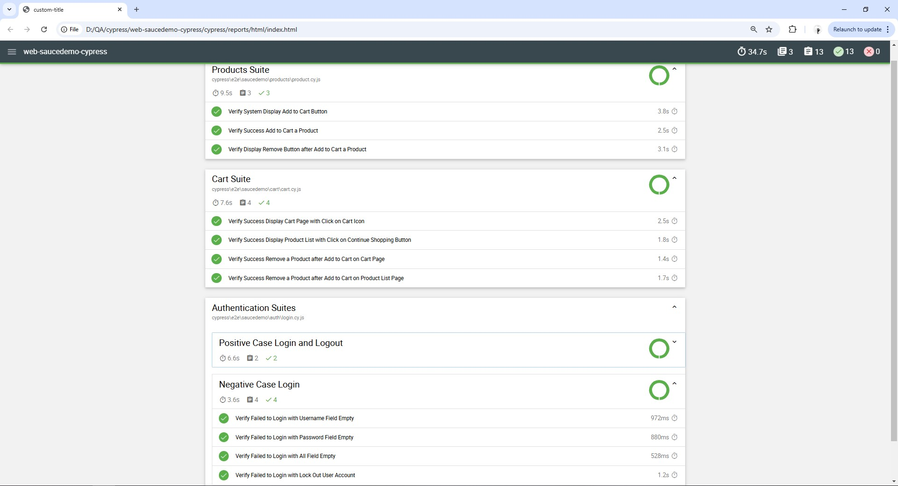
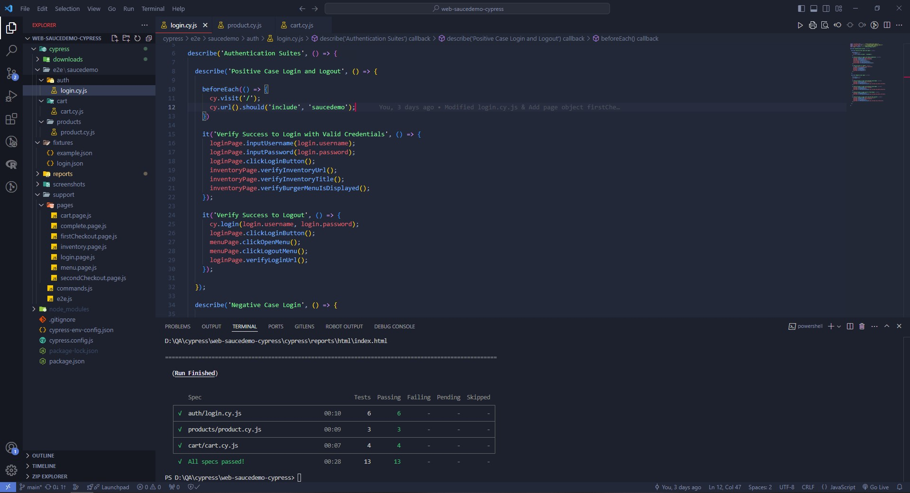

# Web Automation Testing using Cypress on Saucedemo

<p align="center">
    
</p>

This repository is the result of a project practice aimed at learning and applying Web Automation testing using Cypress. The main focus of this project is to validate the core functionalities of Saucedemo. The web automation Saucedemo covering the functional test of auth, cart, and products. This source of project is [Saucedemo](https://www.saucedemo.com/) web demo application. Here's a running demo video of the Saucedemo Funtional testing [Demo running Cypress - Saucedemo](https://youtu.be/9vBLXumI-gU).

## Test Cases and Locator
This link to access [Test Cases](https://docs.google.com/spreadsheets/d/1ApdKCiUPD21bazp0a2tqLUaMsYfxSCXr3-p0CZsMRyA/edit?gid=2144626917#gid=2144626917).
This link to access [Locator - Saucedemo](https://docs.google.com/spreadsheets/d/17RNuoDUOsxU3uT37RerlvGpum5UU9iX-NeSCH_XQBic/edit?gid=668265469#gid=668265469).

## Screenshot of Saucedemo Report
### Mochawesome Report


### Terminal Spec Report


## Getting Started

### Prerequisites

Ensure that you have the following software installed on your machine:

- [Node.js](https://nodejs.org/) (version 14 or higher)
- npm (Node package manager)

### Installation

1. Clone this repository:
   ```bash
   git clone https://github.com/hbibakbr/web-saucedemo-cypress.git
   cd repo
   ```
2. Install cypress
    ```bash
    npm install cypress --save-dev
    ```
5. Install Mochawesome
    ```bash
    npm install mochawesome mocha --save-dev
    ```
6. Running The Suites Test
    ```bash
    npx cypress open
    ```

## 📞 Hello

- **LinkedIn**: [Habib Akbar](https://www.linkedin.com/in/hbibakbr/)  
  Explore my insights, achievements, and project details on my LinkedIn profile. Feel free to connect with me on LinkedIn or leave a comment on any of my posts, cheese!

- **Highlighted Projects on LinkedIn**: [LinkedIn Project Section](https://www.linkedin.com/in/hbibakbr/details/projects/)  
  Explore my project details on my LinkedIn profile.
